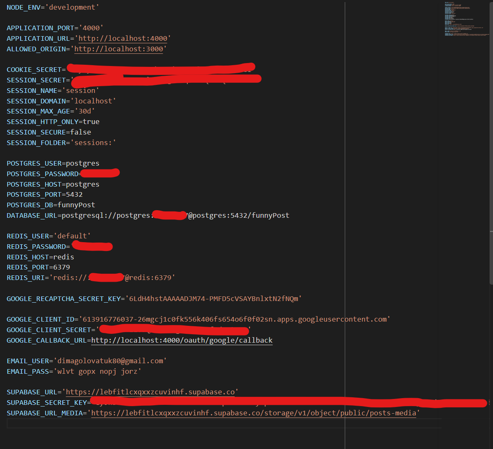
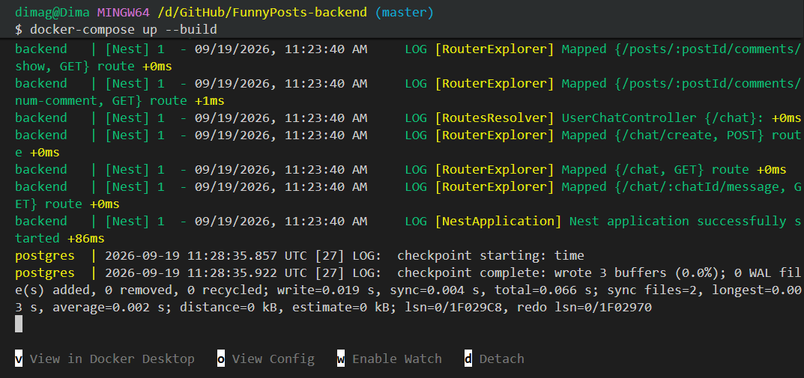

<p align="center">
  <a href="http://nestjs.com/" target="blank"></a>
</p>

<p align="center">
  A progressive <a href="http://nodejs.org" target="_blank">Node.js</a> backend API for the <b>FunnyPosts</b> application, built with NestJS, Prisma, and PostgreSQL.
</p>

<p align="center">
  
  
  
  
  
</p>

## Description

FunnyPosts backend repository. This API handles user authentication, session management, sending emails, and data persistence for the platform.

## 🛠 Prerequisites

To run this project, you need the following tools installed:
* **Node.js** (v18 or higher recommended)
* **Docker & Docker Compose** (recommended for easy database setup)
* **PostgreSQL & Redis** (only if you want to install them manually without Docker)
* **Git** 

## ⚙️ Environment Variables (`.env`) Setup

Before starting the app, you need to configure your environment variables. 
Copy the `.env.example` file and rename it to `.env`:

```bash
$ cp .env.example .env

```

### 1. Basic Configuration

* `PORT` — The port the server runs on (usually `3000`).
* `DATABASE_URL` — Connection string for your PostgreSQL database.
* `REDIS_URL` — Connection string for Redis session management.
* `SESSION_SECRET` — A secure, random string (just type any long random text) used to encrypt session data.
* `CORS_ORIGIN` — The URL of your frontend app (e.g., `http://localhost:5173`).

### 2. Google OAuth (For Google Login)

To get these keys, you need a Google Cloud account:

1. Go to the [Google Cloud Console](https://console.cloud.google.com/?utm_source=gemini).
2. Create a new project.
3. Go to **APIs & Services** > **Credentials**.
4. Click **Create Credentials** > **OAuth client ID** (Choose "Web application").
5. Copy the generated keys into your `.env` file:
* `GOOGLE_CLIENT_ID` = Your generated Client ID.
* `GOOGLE_CLIENT_SECRET` = Your generated Client Secret.
* `GOOGLE_CALLBACK_URL` = e.g., `http://localhost:3000/api/auth/google/callback` (Make sure to add this exact URL in your Google Cloud Console "Authorized redirect URIs").


### 3. Google reCAPTCHA

1. Go to the [Google reCAPTCHA Admin Console](https://www.google.com/recaptcha/admin?utm_source=gemini).
2. Register a new site (choose reCAPTCHA v2 or v3 depending on your frontend setup).
3. Add `localhost` to the domains.
4. Copy the **Secret Key** and paste it here:
* `GOOGLE_RECAPTCHA_SECRET_KEY` = Your Secret Key.


### 4. Email Setup (For sending emails via Gmail)

If you are using a regular Gmail account to send emails, you cannot use your normal password. You need an "App Password":

1. Go to your [Google Account Manage page](https://myaccount.google.com/).
2. Go to the **Security** tab.
3. Make sure **2-Step Verification** is turned ON.
4. Use the search bar to find **App passwords**.
5. Create a new app password (name it something like "FunnyPosts App").
6. Google will give you a 16-character password.
* `EMAIL_USER` = your.email@gmail.com
* `EMAIL_PASS` = The 16-character app password (without spaces).




## 🚀 Project setup

You can start the project using Docker (easier) or locally via your terminal.

### Option 1: Docker (Recommended)

This command will automatically download and start PostgreSQL and Redis containers, and run the backend.

1. Make sure Docker Desktop is running.
2. Run this command in your terminal:

```bash
$ docker-compose up --build

```

3. The API should now be running at `http://localhost:3000`.



### Option 2: Local Terminal

Requires PostgreSQL and Redis to be already installed and running locally on your computer.

1. **Install dependencies:**

```bash
$ npm install

```

2. **Generate Prisma client and run database migrations:**

```bash
$ npx prisma generate
$ npx prisma migrate dev

```

3. **Start the application:**

```bash
# development mode
$ npm run start

# watch mode (auto-restarts on code changes)
$ npm run start:dev

```
